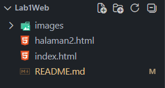

# Praktikum 1: HTML Dasar - Pemrograman Web

Repository ini dibuat untuk menyelesaikan tugas Praktikum 1 Pemrograman Web di Universitas Pelita Bangsa.

Nama : Raihan Arrrasyid Monadika  
Kelas : I251B  
NIM : 312510206  
Mata Kuliah : Pemrograman Web  

---

## Struktur Folder Proyek
```text
Lab1Web/
├── index.html
├── halaman2.html
├── images/
│   └── profil.jpg
└── README.md
```

---

## Langkah-Langkah Praktikum

### 1. Persiapan dan Struktur Dasar HTML
Pada tahap awal ini, kita menyiapkan teks editor (seperti Visual Studio Code), membuat folder kerja bernama `praktikum-1-html-dasar`, dan membuat file `index.html` dengan kerangka struktur dokumen HTML5 standar yang mencakup deklarasi `<!DOCTYPE html>`, tag `<html>`, `<head>`, `<title>`, dan `<body>`.


---

### 2. Membuat Paragraf
Menambahkan beberapa teks paragraf menggunakan tag `<p>` ke dalam dokumen HTML untuk menampilkan konten teks artikel atau informasi pada halaman web.


---

### 3. Menambahkan Judul (Heading)
Menambahkan elemen heading dari level `<h1>` hingga `<h6>` untuk membuat judul utama dan subjudul guna memberikan hierarki pada konten halaman web.


---

### 4. Memformat Teks
Menerapkan berbagai tag pemformatan teks untuk memberikan gaya khusus, seperti teks tebal (`<b>`, `<strong>`), teks miring (`<i>`, `<em>`), penanda (`<mark>`), serta subscript dan superscript (`<sub>`, `<sup>`).


---

### 6. Menyisipkan Gambar
Menambahkan gambar ke dalam halaman web menggunakan tag `` dengan atribut `src` untuk menentukan lokasi file gambar di dalam folder `images/`, serta atribut `alt` dan `title` untuk deskripsi gambar.


---

### 7. Menambahkan Hyperlink
Membuat tautan atau hyperlink menggunakan tag `<a>` dengan atribut `href` untuk menghubungkan halaman web internal (misalnya `halaman2.html`) maupun tautan eksternal ke website lain.


---

### 8. Menambahkan List
Membuat daftar item menggunakan *unordered list* (`<ul>`) untuk daftar tanpa nomor dan *ordered list* (`<ol>`) untuk daftar berurutan.

---

### 9. Menambahkan Komentar
Menambahkan catatan atau dokumentasi internal dalam kode HTML menggunakan tag komentar `<!-- Komentar -->` agar diabaikan oleh browser dan tidak tampil di halaman web.


---

### 10. Menggabungkan Semua Elemen
Menggabungkan seluruh elemen HTML yang telah dipelajari sebelumnya—mulai dari struktur dasar, navigasi, heading, paragraf, gambar, pemformatan teks, list, hingga komentar—menjadi satu halaman web profil mahasiswa yang utuh.


---
